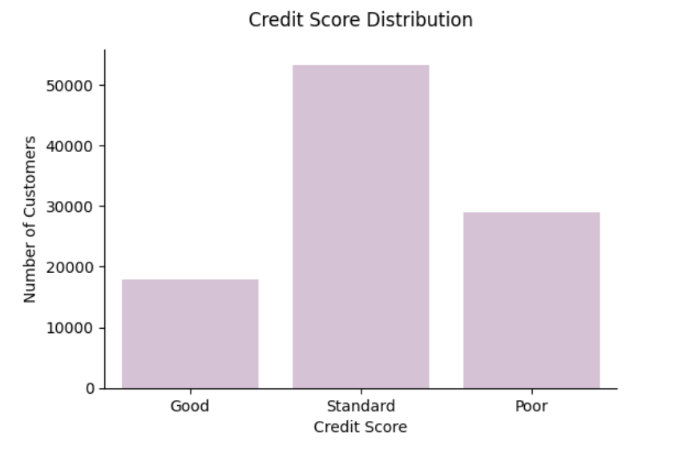
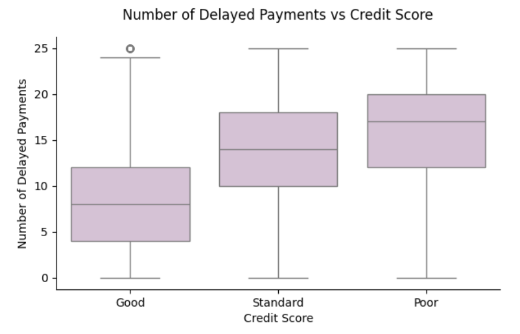
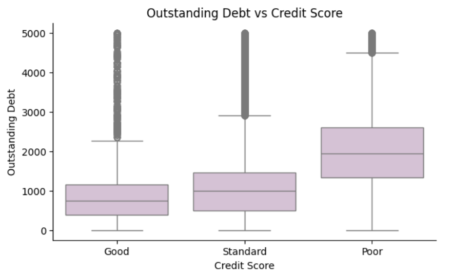
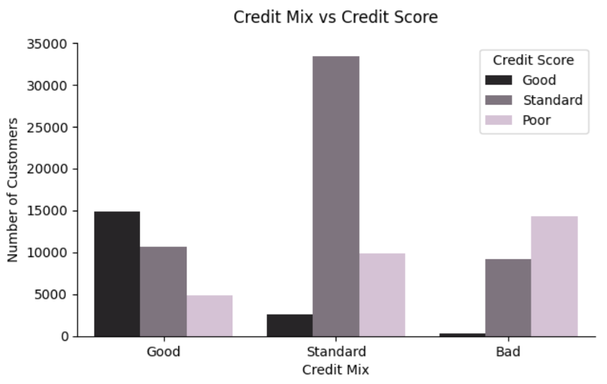
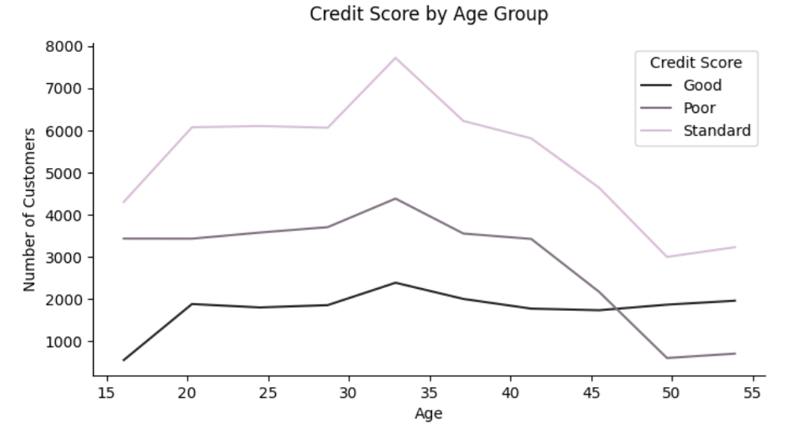
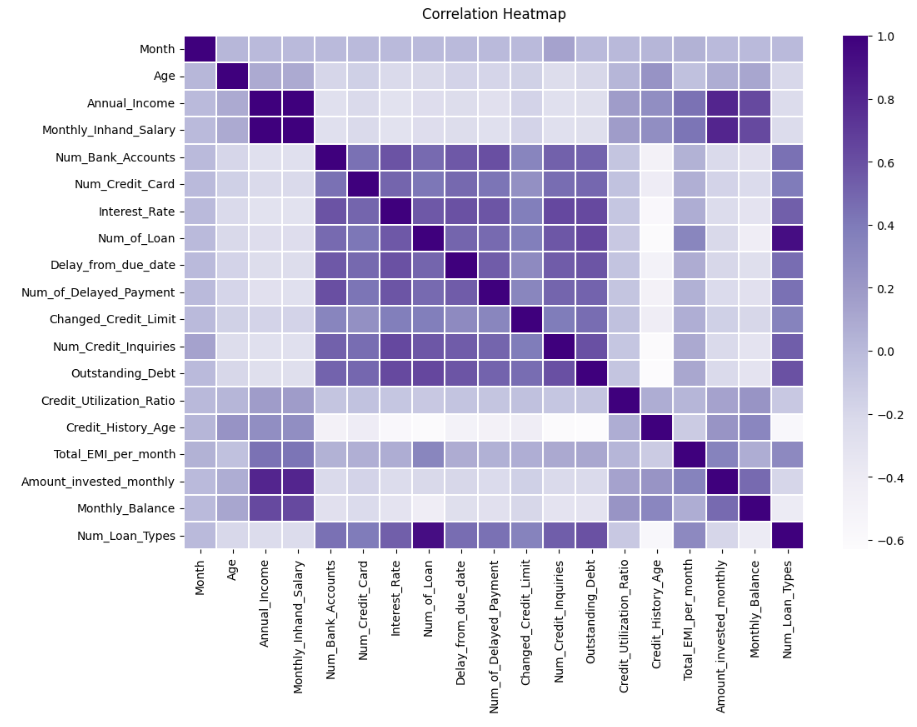
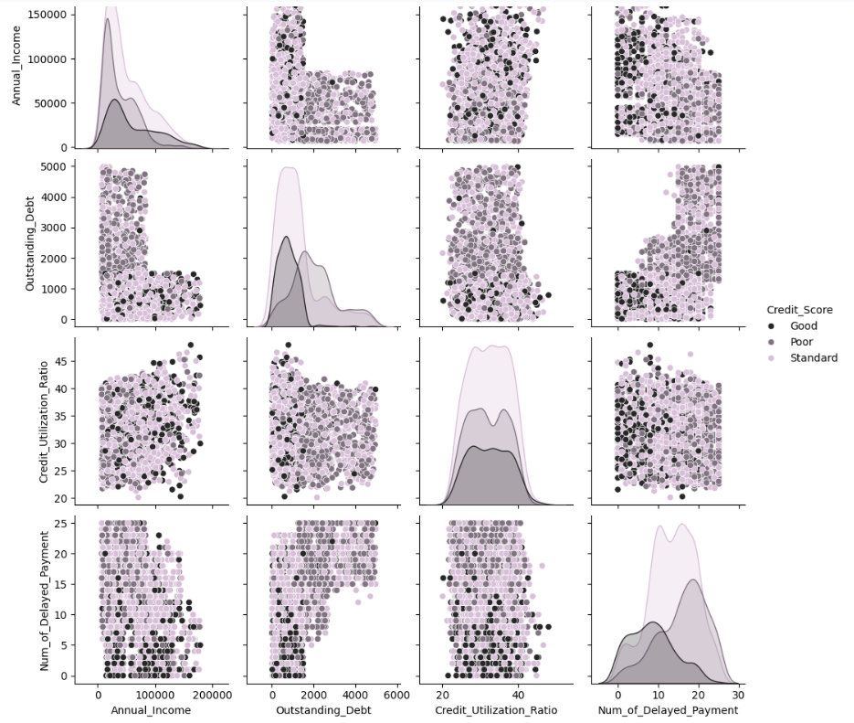
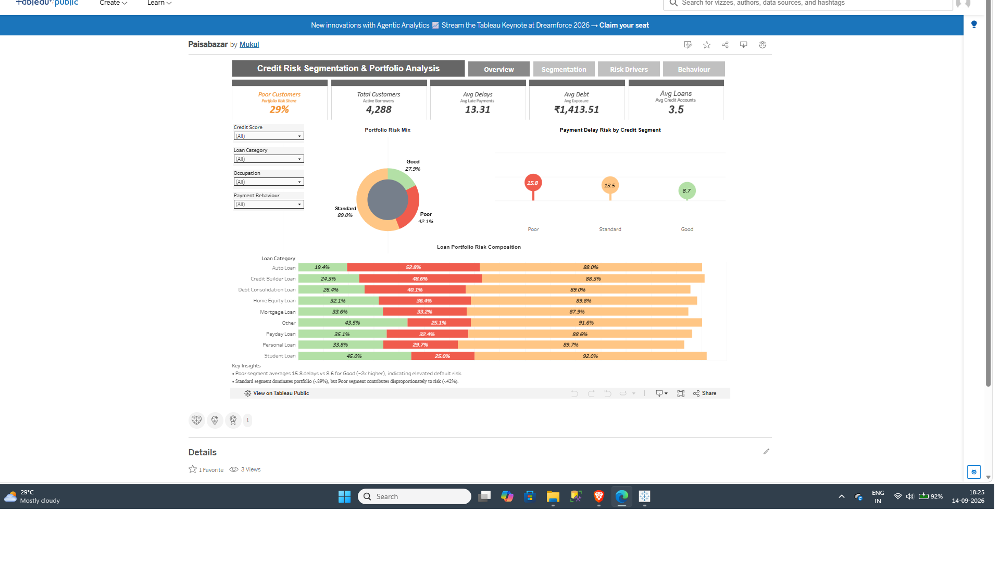

[]()
[]()
[]()
[]()
[]()
[]()
[]()
[]()
[]()
[]()
[]()


# 📊 Paisabazaar Credit Risk Analysis | EDA & Tableau Dashboard

## 🔎 Project Overview

Paisabazaar handles large-scale customer credit and financial data, but understanding the factors that differentiate **Good, Standard, and Poor** credit profiles is essential for effective risk assessment and portfolio management.

This project performs **end-to-end credit risk analysis**, starting with data cleaning and **Exploratory Data Analysis (EDA) in Python**, followed by **interactive Tableau dashboarding** to analyze customer risk segments, identify key credit-risk drivers, and support **data-driven credit and portfolio decisions**.

---

## 🔗 Project Links

- 📊 **[View Interactive Tableau Dashboard](YOUR_TABLEAU_LINK)**
- 🎥 **[Watch Project Walkthrough](YOUR_VIDEO_LINK)**

---

## 🧩 Problem Statement

Paisabazaar has access to detailed customer credit and financial data, but lacks clear visibility into which customer behaviors and financial attributes differentiate **Good, Standard, and Poor** credit profiles.

This project explores and analyzes credit-related data to identify the key factors associated with different credit score categories, supporting more consistent credit assessment and risk-aware decision-making.

---

## 🎯 Business Objectives

- Analyze customer credit and financial data to understand how behavioral and financial attributes vary across different credit score categories
- Identify the key factors linked with **Good, Standard, and Poor** credit profiles
- Build an interactive **Tableau dashboard** to monitor credit-risk segments and key portfolio indicators
- Provide data-driven insights to support credit assessment, risk monitoring, and product recommendations

---

## 📂 Dataset Summary

- **Rows:** 100,000
- **Columns:** 28
- **Target Variable:** `Credit_Score` *(Good / Standard / Poor)*
- **Missing Values:** 0
- **Duplicate Records:** 0

---

## 🧹 Data Wrangling & Cleaning

The dataset was prepared for analysis through the following steps:

- Corrected data type inconsistencies *(float → int for count-based fields)*
- Converted identifier columns (`Customer_ID`, `SSN`, `ID`) to object type
- Cleaned and standardized the multi-valued `Type_of_Loan` column
- Created an additional feature: `Num_Loan_Types`
- Validated dataset consistency after preprocessing *(shape and dtypes)*

---

## 📈 EDA Approach (UBM Framework)

The visualization workflow follows a structured **UBM** approach:

### U — Univariate Analysis

- Credit Score distribution *(target variable)*
- Key feature distributions *(Age, Income, Outstanding Debt, Credit Utilization, Delayed Payments)*

### B — Bivariate Analysis

- Credit Score vs numeric features *(Boxplots)*
  - Delayed Payments vs Credit Score
  - Outstanding Debt vs Credit Score
- Credit Score vs categorical features *(Countplot / Grouped Bar)*
  - Credit Mix vs Credit Score
- Trend-based comparison *(Line Plot)*
  - Credit Score by Age Group

### M — Multivariate Analysis

- Correlation Heatmap *(relationships between numerical variables)*
- Pair Plot *(pattern discovery across multiple features)*

---

## 📊 Python EDA Visualizations (UBM Framework)

### U — Univariate Analysis

#### 1) Credit Score Distribution (Target Variable)



---

### B — Bivariate Analysis

#### 2) Delayed Payments vs Credit Score (Risk Signal)



---

#### 3) Outstanding Debt vs Credit Score (Debt Burden)



---

#### 4) Credit Mix vs Credit Score (Segmentation Insight)



---

#### 5) Credit Score by Age Group (Trend View)



---

### M — Multivariate Analysis

#### 6) Correlation Heatmap (Feature Relationships)



---

#### 7) Pair Plot (Multivariate Patterns)



---

## 🔑 Key Insights

- **Standard is the biggest segment (~53%)**, making it an important segment for credit assessment, product targeting, and risk monitoring.

- **Payment behavior is a strong risk signal** — *Poor* customers show substantially higher delayed payments (**median ~17–18**) compared with *Good* customers (**~7–8**).

- **Debt and loan exposure indicate credit stress** — customers with more active loans (**Poor median ~5 vs Good ~2**) and higher outstanding debt are associated with weaker credit scores.

- **Credit mix provides clear segment differentiation** — customers with a *Good* credit mix are more frequently associated with *Good* scores, while a *Bad* credit mix is more frequently associated with *Poor* scores.

---

## 📊 Tableau Dashboard

The cleaned dataset prepared during the Python data analysis stage was used to build an interactive Tableau dashboard for **credit-risk segmentation and portfolio analysis**.

### Dashboard Objectives

- Monitor the distribution of **Good, Standard, and Poor** credit segments
- Analyze key credit-risk indicators across customer segments
- Identify patterns in debt, loan exposure, and payment behavior
- Enable interactive filtering and segment-level analysis
- Support data-driven credit-risk and portfolio decisions

### 🔗 Interactive Dashboard

[**Open Tableau Dashboard**](YOUR_TABLEAU_LINK)

### Dashboard Preview



---

## 💡 Business Recommendations

- Prioritize **repayment behavior signals** such as delayed payments and due-date patterns when assessing credit risk
- Apply a **Debt Stress Check** using outstanding debt and loan exposure to identify higher-risk profiles
- Focus on improving the **Standard** segment through structured credit improvement strategies and risk-aware product recommendations

---

## 🏁 Conclusion

This project combines **Python-based exploratory data analysis with interactive Tableau dashboarding** to provide an end-to-end view of customer credit risk.

The analysis identifies key risk drivers such as **payment behavior, debt burden, loan exposure, and credit mix**, while the Tableau dashboard enables interactive exploration of these patterns across different customer segments.

The resulting insights can support **consistent credit assessment, risk monitoring, and data-driven product recommendations**.

---

## 🛠 Tools & Technologies

- **Programming & Analysis:** Python, Pandas, NumPy
- **Data Visualization:** Matplotlib, Seaborn, Plotly
- **Dashboarding:** Tableau
- **Environment:** Google Colab, Jupyter Notebook

---

## 📁 Repository Structure

```text
Paisabazaar-Banking-Fraud-Analysis/
│
├── data/
│   ├── raw/
│   └── processed/
│
├── docs/
│   └── screenshots/
│
├── notebooks/
│   └── PaisabazaarBankingFraudProject.ipynb
│
├── tableau/
│   └── Paisabazaar.twb
│
├── README.md
└── requirements.txt
